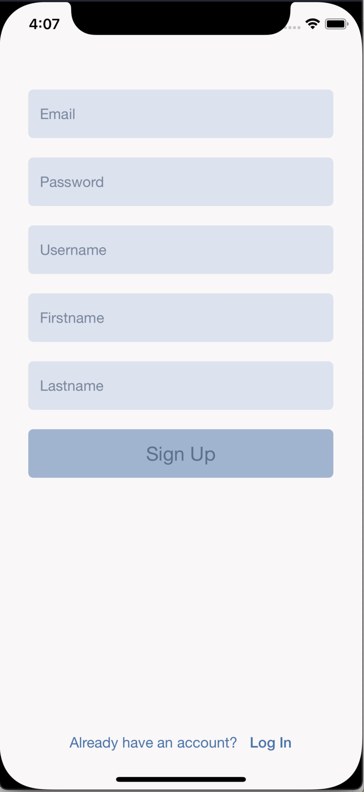

# ConnectIst - Facebook Clone
- I have created this application for training purposes.
- I have used both the storyboard and custom user interfaces.
- I have used PHP backend and JSON data for saving and showing data.
- Object Oriented Programming
- MVVM Architecture
- CocoaPods Alamofire
- [CocoaPods Alamofire](https://cocoapods.org/pods/Alamofire)

# Screen Shots of the Application

   

